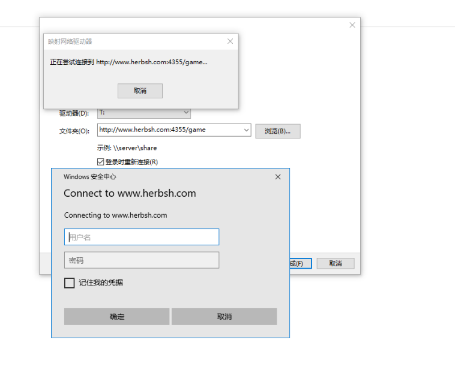

# Hellclient快速使用指南

Hellclient是一款B/S(浏览器/服务器)架构,跨系统的Mud客户端/脚本服务软件。

目标是兼容Mushclient的主要功能并作扩展。

本文描述了怎么快速的使用Hellclient客户端

## 下载

首先先要下载Hellclient。

稳定版的标准下载地址是 https://github.com/jarlyyn/hellclient/releases

测试/预览/集成代码版本可能有其他的下载渠道

下载后进行解压到合适的地方，即完成了安装

## 设置

目前版本的Hellclient的设置文件只有一个，为安装位置的/config/system.toml

TOML是一个公开的配置文件格式，语法可参考 https://toml.io/en/

由于本软件设置较为简单，只要修改默认设置为设施的值即可

注意，所有对于system.toml的修改，需要关闭并重新启动客户端才能生效

### 编辑工具

由于TOML文件默认不使用Windows的换行符，所以不能用记事本进行编辑。

我一般使用Vscode编辑，临时编辑的话使用Windows自带的写字板工具

### 设置打开方式

system.toml文件中的Addr参数决定了怎么通过浏览器打开客户端。一般有两种取值

* 本机打开，设置为 Addr="127.0.0.1:4355"
* 可从外部打开，如在VPS/NAS上运行，一般设置为 ":4355"

4355为端口号，可以根据情况调整
然后在浏览器里输入 http://127.0.0.1:4355 (本机) 或 http://IP地址:4355 即可访问

特别的，为了安全起见，监听 外部端口时，强烈建议同时开启  Username和Password做登陆验证

如
```
Username="abc"
Password="123"
```

这个设置好后，就可以正常使用客户端了

### 可选设置之 Hellclient交换机

Hellclient交换机是一个运行在网络上的，用于交换不同的 客户端之间的广播消息的服务。

需要脚本配合使用，如果不知道有什么用，可以不设。

在成功连接Hellclient网络后，会在网页界面右上角显示状态图标，表示是否正常连接

### 可选设置之 邮箱(SMTP)设置

为了方便实现通知功能，在配置文件里提供了设置邮箱的方式

具体的设置值参考设置文件里的说明

特别的，可以填写URL参数，用于在邮件里提供外联，直接点击进入

## 使用说明

运行主程序(下载目录的/bin/hellclient.exe)后，会出现一个dos窗口进行简单信息的提示。这时通过浏览器可以打开查看客户端了

### 管理游戏

刚进入客户端时,应该只能开到3个按钮

这三个按钮分别是打开游戏，全部游戏列表，版本信息

主要的功能按钮是第一个蓝色按钮打开游戏按钮

点击打开按钮后，会出现所有的未打开游戏的界面


打开游戏界面中能进行的操作有三个

* 右上角的叉或按Esc按钮，关闭当前界面
* 游戏列表右侧的打开按钮，打开游戏
* 蓝色的加号按钮，添加游戏

### 新建游戏

新下载的客户端应该是没有游戏数据的，这时候应该点击创建按钮新建游戏。


在这里需要填写4个必填属性

* 名称，字母数字-_.等符号(为了跨系统支持，不支持中文，避免编码问题)
* 网址，服务器ip
* 端口, 服务器端口
* 编码，Mud的编码，中文游戏的话大概率是GBK编码

创建失败会提示创建失败的原因

而创建成功的话，会生成一个同名的toml文件，并自动进入游戏

### 游戏界面

打开已有游戏或新建游戏后会进入游戏界面


游戏界面包含3个部分

* 游戏列表，现在已经打开的游戏列表，在游戏前的图标表示游戏的连接状态
* 操作按钮，具体之后解释
* 游戏显示。点击后会弹出历史记录

按钮说明

第一组

* 连接/断线按钮
* 关闭游戏按钮
* 显示历史信息
  
第二组
* 游戏详情/修改
* 使用脚本/机器人。

注意，与mush不同，hellclient里游戏和脚本是很独立的两个部分，一般情况是，是多个游戏进行不同的id设置，通过同一套脚本进行挂机

第三组
* 变量 游戏变量。里面分为全部变量和脚本变量，一般的机器人设置脚本变量即可
* 触发器，基本同mush。注意，这个触发器是跟随ID的，一般是为了ID做特殊处理
* 计时器，基本同mush。注意，这个计时器是跟随ID的，一般是为了ID做特殊处理
* 别名，基本同mush。注意，这个别名是跟随ID的，一般是为了ID做特殊处理

第四组
* 蓝色保存按钮。这个按钮独自一组，并有颜色，是因为他非常重要。之前的所有设置，如果不保存，再下次打开游戏时都会失效

**对游戏做过设置时请保存！！**

**对游戏做过设置时请保存！！**

**对游戏做过设置时请保存！！**

第五组
* 重新加载脚本，同mush的reload功能
* 高级模式，用于制作和调试机器人

### 游戏输入

游戏输入部分集中在页面的下侧


依次分别为

* 游戏ID,说明当前是哪个游戏
* 人型按钮，助理图标，需要运行的脚本支持，可以快速调用功能，类似于Windows的开始菜单
* 输入框，输入并发送文字到mud
* 省略号的历史输入信息

这里一般只需要使用助理按钮和输入框就能正常游戏了

## 维护

客户端中创建的游戏，使用的脚本和日志都在安装目录的/appdata/game下
分别为
* /appdata/game/worlds 游戏文件,每个游戏以toml格式储存
* /appdata/game/scripts 脚本目录
* /appdata/game/logs 日志目录

在备份或升级客户端时，只要备份appdata/configs目录即可

### 网盘挂载

如果你的客户端可以通过公网访问，那么你可以通过webdav协议将/appdata/game目录挂载到你本地电脑上，快速的进行维护，设置可以充当临时网盘使用

连接的地址为 http://你的ip:4355/game/

Windows下的使用方式是在资源管理器里右键添加网络位置即可




注意，如果你没有安装SSL证书(正常都不会安装)，需要在注册里进行设置允许非https方式挂载webdav网盘

```
Windows Registry Editor Version 5.00
[HKEY_LOCAL_MACHINE\SYSTEM\CurrentControlSet\Services\WebClient\Parameters]
"BasicAuthLevel"=dword:00000002
```


参考:

* https://docs.microsoft.com/zh-cn/iis/publish/using-webdav/using-the-webdav-redirector
* https://post.smzdm.com/p/750699/
* https://zhuanlan.zhihu.com/p/352216119